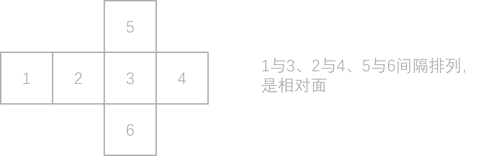
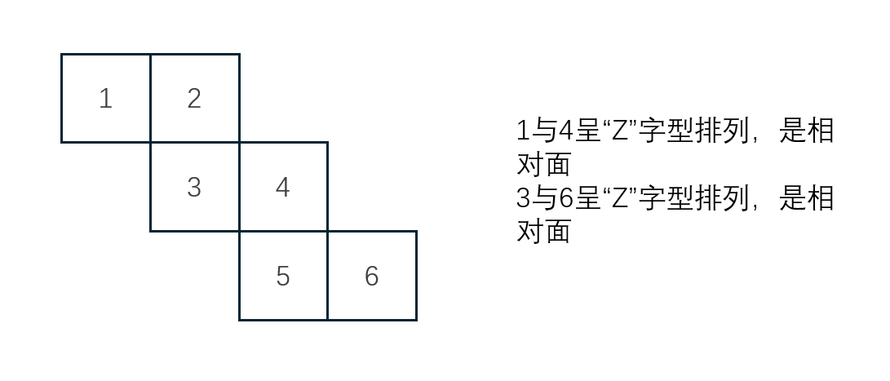
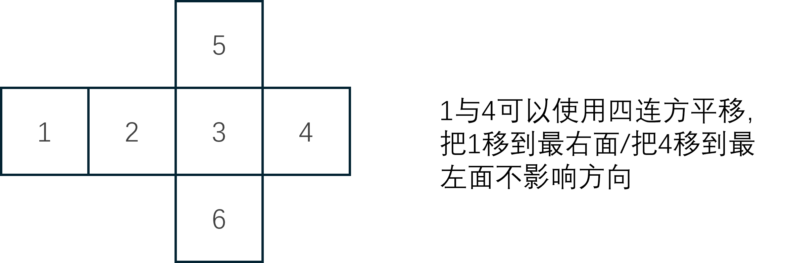
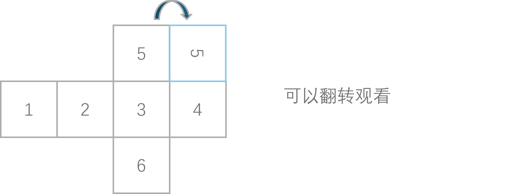
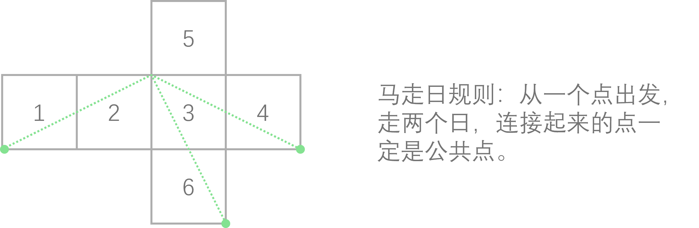
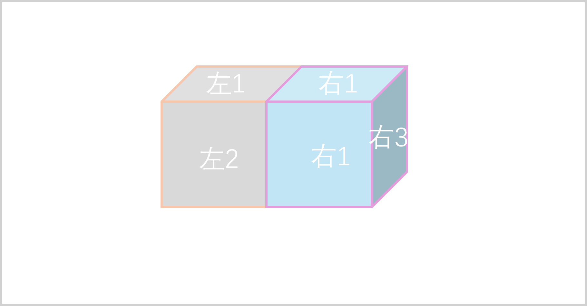

# 立体图推

## 空间折叠（六面体）

### 相对面的排查

通过排查相对面来确定六面体的结构。

#### 寻找相对面的规则

1. **间隔排列规则**：

   在平面展开图的同一行或同一列中，中间仅相隔一个面的两个面，必定互为相对面。

    

2. **“Z”字型规则**

   在展开图中，呈紧凑型“Z”字型两端的两个面，必定互为相对面。

    

### 特征面的指引

特征面有指向有相邻面有相对面，根据特征面来确定答案。

### 公共边和公共点

公共边:两个相邻面必定共用一条边。呈现90度角的时候，必定是公共边

公共点:可视的三个面必定共用一个公共点

### 展开图移面法则

四连方平移:存在四个面连成一条直线，最两端的面可以互相平移。即最左侧的面可以直接平移到最右侧，平移后的内部方向不会发生改变

垂直旋转平移（滚面）:一个面沿垂直于他所在行（或列的方向移动，每移动一格跨越到另一个相邻面边缘时，其内部图案必须顺时针（或逆时针旋转90°）

### 马走日解题法

本质是公共点判别思维，通过公共点锁定面之间的邻接关系。

任意两个可以通过两个日字连接的点一定是公共点。

### 特殊考点

* 多个六面体拼合

比如两个六面体，左侧六面体露出两个面，右侧六面体露出三个面。

左侧六面体作为排查的线索，因为这个六面体只有两个相邻面，

* 碎片六面体的拼合

碎片面:把原来的第六个面分为几个碎片，也遵循滚面原则

* 黑白块长方体拼合

宏观观察:拐角的黑白对应关系

数量检索:数黑块数量

选项代入

## 三视图

做题方法（捷径）:四个选项中会有一对对立视角的图形（左对右，上对下，前对后）。优先进行对立视角的辨析，答案九成都在这组图形中

不用这个方法应该也很简单

## 截面图

用一个无限大的截面切开立体图形

有一些截面公式:

正方体（长方体）:三角形（锐角三角形）、四边形（正方形、长方形、平行四边形、梯形）、五边形、**最多切到六边形**

圆柱体:圆形（横切）、椭圆形（斜切，不碰上下底）、长方形、半椭圆/拱形（斜切，切到一个底面）、**正切才会是全直线，斜切会有曲线**

圆锥体：圆、三角形、椭圆（斜切不碰底面）、抛物线形曲面（斜切过底面）

圆台体：圆、椭圆、梯形、等腰梯形

## 立体拼合

### 方块计数法

小正方体数量之和等于目标图形包含的小正方体总数。题目复杂度高的建议使用分层：

### 凹凸互补法

寻找极端特征，直接锁定已知组件中最突兀的部分；极端突起和极端凹陷；平行互补原则：拼合面的接触形状必须完全一致

### 最长骨架定位

利用边最长或占地最广的组件锁定空间位置，两个方法：占满边界法（贴着目标图的外部边缘放置）和建立基准系（）

### 特殊块定位

特殊块的位置，但是要注意镜像陷阱

## 冷门考点

### 面积考点

阴影面积占比（恒定比例，等差比例）

面积大小比对或者分组

### 周长考点

周长相等或者等差关系

### 正四面体折叠（江苏）

正四面体的折叠全部围绕公共点公共边展开

公共点:在平面展开图中，直线距离为2的点为公共点

公共边:在平面展开图中处于同一条直线上或处于两条相互平行的线为公共边

### 平面拼合（江苏比较多见）

几个多边形的碎片组，将其严丝合缝的拼合成一个相对规则的整体

采用“边界抵消”的思路进行降维排查

1. 由于碎片只能平移，当两块碎片拼合在一起时，它们的接触边必须满足的条件是倾斜角度完全相同，即线段平行。

2. 特殊角的锚定，当目标图形为正方形或者矩形时，它的四个角必须是90度，那就需要在图形中找含有直角的碎片。或者寻找可以角度互补的碎片。

3. 面积或者极值边的辅助：面积估算的话，把最大面积的碎片定位为该图形中的地基，再将其他碎片填入空隙；最长边法则的话，寻找碎片中最长一边，这长边往往直接构成目标图形的外轮廓边，通过其长度可迅速圈定整体图形的规格

4. 如果要蒙答案的话，就蒙看起来更规矩的图形

### 允许翻转旋转的平面拼合

从哪入手?

1. 图形本身非轴对称，翻转旋转后好识别

2. 有独特特征的图形，从大碎片入手

3. 旋转必同色，翻转必异色
