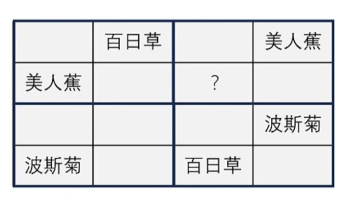

# 对应推理

给出的都是确定信息，在这些确定信息中提取推理要素，锁定唯一正确的对应情况。

有一点像数独。

解题方法：

1. 缺项法：元素出现较多的行货列，根据已经出现的元素排除确实位置的元素可能，从而确定某个单元格的取值。

2. 交叉排除法：寻找空缺位置对应行列已经出现的元素，通过行列交叉双重限制该元素选择的可能性，进而确定空缺位置元素取值。

这一部分没有什么多的知识点。

附一个例题：

1. 每一行和每一列都要用到四种花卉
2. 每个田字格中也都要用到四种花卉
3. 图中花卉的位置不能移动

