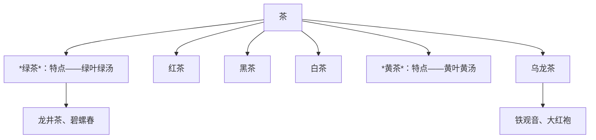

## 茶的分类

常见茶叶有六大品类
1. 绿茶
2. 红茶
3. 黑茶
4. 白茶
5. 黄茶
6. 乌龙茶

```mermaid
graph TD
    Tea[茶] --> A[*绿茶*：特点——绿叶绿汤]
    A --> A1[龙井茶、碧螺春]
    Tea --> B[红茶]
    Tea --> C[黑茶]
    Tea --> D[白茶]
    Tea --> E[*黄茶*：特点——黄叶黄汤]
    Tea --> F[乌龙茶]
    F--> F1[铁观音、大红袍]
```